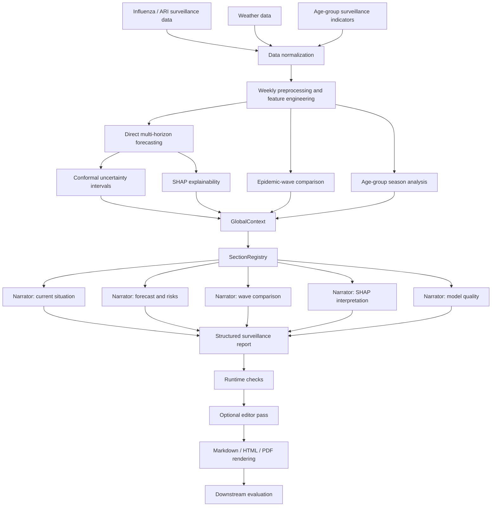

# AI4Epi


**AI4Epi** is a Python framework for **AI4Science-oriented epidemic surveillance report generation** from epidemiological time series. It combines weekly influenza/ARI surveillance data, weather covariates, short-term interpretable forecasting, structured analytical context, section-level LLM agents, deterministic runtime checks, and downstream report evaluation.

The system is designed for researchers and developers who need more than point forecasts: it turns quantitative surveillance evidence into grounded, interpretable, evidence-controlled analytical reports for epidemic decision-support scenarios.

> **License notice.** This repository is source-available for academic review and reproducibility inspection only. Reuse, redistribution, modification, commercialization, or integration into other projects requires explicit written permission from the author.

> The codebase still uses the term `bulletin` in CLI commands and internal artifact names for historical compatibility. In research-facing terminology, the target output is a **surveillance report**.

---

## Table of contents

- [What problem does AI4Epi solve?](#what-problem-does-ai4epi-solve)
- [Core capabilities](#core-capabilities)
- [Architecture](#architecture)
- [Repository layout](#repository-layout)
- [Installation](#installation)
- [Local LLM backend](#local-llm-backend)
- [Quick start](#quick-start)
- [Running the pipeline stage by stage](#running-the-pipeline-stage-by-stage)
- [Input data contracts](#input-data-contracts)
- [Generated report structure](#generated-report-structure)
- [Artifacts](#artifacts)
- [Configuration](#configuration)
- [Programmatic API](#programmatic-api)
- [Adding a new report section](#adding-a-new-report-section)
- [Evaluation layer](#evaluation-layer)
- [Research methodology](#research-methodology)
- [Limitations](#limitations)
- [Development](#development)
- [Troubleshooting](#troubleshooting)
- [Roadmap](#roadmap)
- [License and code usage](#license-and-code-usage)
- [Academic context](#academic-context)

---

## What problem does AI4Epi solve?

Epidemiological surveillance systems provide observations, signals, and forecasts, but expert decision support usually requires an interpretable analytical report rather than raw numbers alone.

AI4Epi addresses the following task:

> Given weekly epidemic surveillance data and auxiliary signals, produce a grounded surveillance report that explains the current situation, short-term forecast, uncertainty, epidemic-wave comparison, age-group patterns, model interpretation, and model limitations.

The project treats surveillance report generation as an integrated AI4Science task:

1. **Quantitative layer**  
   Builds a reproducible analytical context from surveillance data, weather covariates, forecasts, uncertainty intervals, SHAP explanations, epidemic-wave geometry, and age-group season summaries.

2. **Structured context layer**  
   Converts numerical results into a validated `GlobalContext` contract that can be checked and reused by report-generation agents.

3. **Multi-agent language layer**  
   Uses role-separated section-level agents to generate report sections from explicit evidence packets.

4. **Quality-control layer**  
   Applies deterministic runtime checks and downstream evaluators for numerical accuracy, factual consistency, redundancy, grammar, spelling, formatting, and writing style.

---

## Core capabilities

AI4Epi currently supports:

- loading weekly influenza/ARI surveillance data from the influenza database used in the research pipeline;
- loading meteorological covariates from the Open-Meteo Archive API;
- running the same analysis pipeline from already prepared local tables;
- weekly time-series preprocessing and feature engineering;
- direct multi-horizon forecasting for horizons `h = 1..4`;
- point forecasting with `HistGradientBoostingRegressor`;
- split-conformal prediction intervals for forecast uncertainty;
- SHAP-based forecast interpretation;
- epidemic-wave comparison across recent seasons;
- age-group seasonal burden and peak-width analysis;
- construction of a typed `GlobalContext`;
- section-level LLM report generation through a local Ollama-compatible backend;
- optional plain-language editor pass;
- deterministic runtime checks for generated text;
- downstream evaluation with numeric, factual, logical, redundancy, grammar, orthotypography, and style evaluators;
- Markdown, HTML, and PDF rendering;
- deterministic publication figures and tables attached to generated reports;
- one-command end-to-end workflow and stage-by-stage CLI commands.

---

## Architecture



The main engineering principle is separation of responsibilities:

| Layer | Responsibility |
|---|---|
| `data` | Fetch and normalize primary data sources. |
| `analysis` | Build numerical evidence: preprocessing, forecasting, uncertainty, SHAP, waves, age groups, context. |
| `core` | Define typed contracts, configuration, I/O, and report-section registry. |
| `generation` | Execute section-level LLM agents and assemble structured reports. |
| `quality` | Run deterministic checks and downstream evaluation. |
| `output` | Render Markdown, HTML, PDF, publication figures, and tables. |
| `orchestration` | Run the full workflow from data sources or local tables. |

---

## Repository layout

```text
.
├── pyproject.toml
├── README.md
├── runs/
│   ├── latest_narrators/
│   ├── latest_no_eval_pdf/
│   └── latest_no_eval_pdf_figures/
└── src/
    └── ai4epi/
        ├── analysis/
        │   ├── age_group_season.py
        │   ├── analysis_pipeline.py
        │   ├── context_builders.py
        │   ├── epidemic_waves.py
        │   ├── explainability.py
        │   ├── forecasting.py
        │   └── preprocessing.py
        ├── core/
        │   ├── config.py
        │   ├── context.py
        │   ├── io.py
        │   └── sections.py
        ├── data/
        │   ├── influenza.py
        │   └── weather.py
        ├── generation/
        │   ├── bulletin.py
        │   ├── editor.py
        │   ├── narrator.py
        │   └── pipeline.py
        ├── orchestration/
        │   └── workflow.py
        ├── output/
        │   ├── figures.py
        │   ├── pdf.py
        │   ├── rendering.py
        │   └── tables.py
        ├── quality/
        │   ├── evaluation.py
        │   └── runtime_checks.py
        └── cli.py
```

The checked-in `runs/` directory contains example artifacts from completed pipeline executions. It can be used to inspect the expected output structure and report-rendering format.

---

## Installation

AI4Epi requires **Python 3.11+**.

### Linux / macOS

```bash
python -m venv .venv
source .venv/bin/activate

python -m pip install --upgrade pip
python -m pip install -e .
```

### Windows PowerShell

```powershell
python -m venv .venv
.venv\Scripts\Activate.ps1

python -m pip install --upgrade pip
python -m pip install -e .
```

### Development dependencies

```bash
python -m pip install -e ".[dev,test,notebook]"
```

### Check the CLI

```bash
ai4epi --help
```

Expected top-level commands:

```text
init-config
run-analysis-source
run-analysis-tables
run-all
generate-bulletin
evaluate-bulletin
render
render-pdf
```

---

## Local LLM backend

AI4Epi currently uses an Ollama-compatible chat backend.

Start Ollama locally:

```bash
ollama serve
```

Pull a narrator model:

```bash
ollama pull qwen3:8b
```

For downstream evaluation, a separate evaluator model can be used:

```bash
ollama pull gemma3:12b
```

The CLI passes the model name directly to the local Ollama API. Any installed Ollama model can be used if it supports the required chat interface and JSON-oriented prompting.

Default backend URL:

```text
http://localhost:11434
```

---

## Quick start

Run the complete source-based workflow for Saint Petersburg:

```bash
ai4epi run-all \
  --city spb \
  --model qwen3:8b \
  --evaluator-model gemma3:12b \
  --output-dir runs/spb_latest \
  --render-pdf
```

This command runs:

1. influenza/ARI data loading;
2. weather loading;
3. preprocessing and feature engineering;
4. forecasting;
5. conformal uncertainty estimation;
6. SHAP explainability;
7. epidemic-wave comparison;
8. age-group seasonal analysis;
9. `GlobalContext` construction;
10. section-level surveillance report generation;
11. optional editor pass;
12. downstream evaluation;
13. Markdown, HTML, and PDF rendering.

Typical output structure:

```text
runs/spb_latest/
├── analysis/
│   ├── context_relevant.json
│   ├── analysis_run.json
│   ├── merged_weekly.csv
│   ├── preprocessing/
│   ├── forecasting/
│   ├── explainability/
│   ├── epidemic_waves/
│   ├── age_group_season/
│   └── sources/
├── bulletin/
│   ├── bulletin_base.json
│   ├── bulletin_base.md
│   ├── bulletin_edited.json
│   ├── bulletin_edited.md
│   ├── narration_results.json
│   ├── editor_run.json
│   └── pipeline_run.json
├── evaluation/
│   └── evaluation_report.json
├── rendered/
│   ├── bulletin_rendered.md
│   ├── bulletin_rendered.html
│   ├── render_manifest.json
│   └── figures/
├── pdf/
│   ├── bulletin_base.pdf
│   ├── bulletin_edited.pdf
│   ├── pdf_base_manifest.json
│   └── pdf_edited_manifest.json
└── workflow_run.json
```

If `--end-date` is omitted, the workflow uses the latest available surveillance week after data loading and writes the resolved date to `workflow_run.json` as `effective_end_date`.

---

## Running the pipeline stage by stage

### 1. Numerical analysis from sources

```bash
ai4epi run-analysis-source \
  --city spb \
  --begin-year 2011 \
  --begin-week 1 \
  --output-dir analysis_outputs
```

Optional fixed endpoint:

```bash
ai4epi run-analysis-source \
  --city spb \
  --begin-year 2011 \
  --begin-week 1 \
  --end-date 2026-04-20 \
  --output-dir analysis_outputs
```

The main output for report generation is:

```text
analysis_outputs/context_relevant.json
```

### 2. Numerical analysis from local tables

```bash
ai4epi run-analysis-tables \
  --influenza-weekly data/influenza_weekly.csv \
  --weather-weekly data/weather_weekly.csv \
  --age-group-frame data/age_groups.csv \
  --output-dir analysis_outputs
```

The table-based command is useful for reproducible experiments, offline runs, and ablation studies where the source-loading stage should be fixed.

### 3. Create a report-generation config

```bash
ai4epi init-config \
  --context analysis_outputs/context_relevant.json \
  --model qwen3:8b \
  --output-dir outputs \
  --run-editor \
  --config-out configs/run_local.json
```

### 4. Generate the surveillance report

```bash
ai4epi generate-bulletin \
  --config configs/run_local.json
```

Typical outputs:

```text
outputs/
├── bulletin_base.json
├── bulletin_base.md
├── bulletin_edited.json
├── bulletin_edited.md
├── narration_results.json
├── editor_run.json
└── pipeline_run.json
```

### 5. Render Markdown and HTML

```bash
ai4epi render \
  --bulletin outputs/bulletin_edited.json \
  --output-dir outputs/rendered
```

### 6. Render PDF

```bash
ai4epi render-pdf \
  --bulletin outputs/bulletin_edited.json \
  --output-dir outputs/pdf
```

For Cyrillic report text, the PDF renderer needs a Unicode TTF font. If an appropriate system font is not found automatically, pass explicit font paths:

```bash
ai4epi render-pdf \
  --bulletin outputs/bulletin_edited.json \
  --output-dir outputs/pdf \
  --font-regular /usr/share/fonts/truetype/dejavu/DejaVuSans.ttf \
  --font-bold /usr/share/fonts/truetype/dejavu/DejaVuSans-Bold.ttf
```

On Windows, use installed TTF fonts from `C:\Windows\Fonts` when rendering Cyrillic reports.

### 7. Evaluate a generated report

```bash
ai4epi evaluate-bulletin \
  --context analysis_outputs/context_relevant.json \
  --bulletin outputs/bulletin_edited.json \
  --config configs/run_local.json \
  --output outputs/evaluation_report.json
```

To disable LLM-based evaluators and run only deterministic checks:

```bash
ai4epi evaluate-bulletin \
  --context analysis_outputs/context_relevant.json \
  --bulletin outputs/bulletin_edited.json \
  --no-llm \
  --output outputs/evaluation_report.json
```

---

## Input data contracts

### Weekly influenza/ARI table

The core weekly modeling table must contain:

| Column | Type | Meaning |
|---|---:|---|
| `datetime` | datetime | Week anchor date. |
| `iso_year` | integer | ISO year. |
| `iso_week` | integer | ISO week number. |
| `inc_per_10k` | numeric | Incidence per 10,000 population. |

Source-derived weekly tables can additionally contain:

| Column | Type | Meaning |
|---|---:|---|
| `total_population` | numeric | Population denominator. |
| `total_cases_formula` | numeric | Case count used for incidence calculation. |

### Weekly weather table

The weather table must contain:

| Column | Type | Meaning |
|---|---:|---|
| `week_start` | datetime | Week start date. |
| `temp_mean` | numeric | Mean weekly temperature. |
| `temp_max` | numeric | Maximum weekly temperature. |
| `temp_min` | numeric | Minimum weekly temperature. |
| `rh_mean` | numeric | Mean weekly relative humidity. |
| `rh_max` | numeric | Maximum weekly relative humidity. |
| `rh_min` | numeric | Minimum weekly relative humidity. |
| `n_hours` | integer | Number of hourly observations used for aggregation. |

### Hourly weather table

When weekly weather is not precomputed, hourly weather must contain:

| Column | Type | Meaning |
|---|---:|---|
| `time` | datetime | Hour timestamp. |
| `temp` | numeric | Temperature. |
| `rh` | numeric | Relative humidity. |

### Age-group table

The default age-group analysis expects `datetime`, total population/cases, and the following age-group case and population columns:

| Age group | Cases column | Population column |
|---|---|---|
| Total | `ari_total_cases` | `total_population` |
| 0–2 | `ari_cases_age_group_0` | `population_age_group_0` |
| 3–6 | `ari_cases_age_group_1` | `population_age_group_1` |
| 7–14 | `ari_cases_age_group_2` | `population_age_group_2` |
| 15–64 | `ari_cases_age_group_4` | `population_age_group_4` |
| 65+ | `ari_cases_age_group_5` | `population_age_group_5` |

The age-group block is optional by default. It can be made mandatory with:

```bash
ai4epi run-analysis-source \
  --city spb \
  --require-age-group \
  --output-dir analysis_outputs
```

---

## Generated report structure

The default report registry contains seven sections:

| Section ID | Title | Purpose |
|---|---|---|
| `current_situation` | Current situation | Observed incidence level, recent trend, short forecast summary. |
| `epidemic_wave_comparison` | Epidemic-wave comparison | Comparison of recent epidemic waves by peak height, peak timing, width, and seasonal burden. |
| `age_group_season_overview` | Age-group structure | Current-season age-group peak and burden analysis. |
| `forecast_risks` | Forecast and risk assessment | Point forecast, uncertainty intervals, and risk interpretation. |
| `shap_interpretation` | Model interpretation | SHAP-based explanation of forecast drivers. |
| `model_quality` | Model quality and limitations | Forecast metrics, error patterns, and practical constraints. |
| `model_description` | Model description | Compact model card for the report. |

Each section receives only a section-specific evidence packet extracted from `GlobalContext`. This keeps generation grounded and limits cross-section information leakage.

---

## Artifacts

### Analysis artifacts

```text
analysis/
├── context_relevant.json
├── analysis_run.json
├── merged_weekly.csv
├── sources/
│   ├── influenza_spb_cases_normalized.csv
│   ├── influenza_spb_weekly_2011_to_latest_formula.csv
│   ├── weather_hourly.csv
│   ├── weather_weekly.csv
│   └── weather_location.json
├── preprocessing/
│   ├── supervised_data.csv
│   └── feature_list.csv
├── forecasting/
│   ├── metrics_summary.csv
│   ├── test_predictions.csv
│   ├── forecast_next_4w.csv
│   ├── history_plus_forecast_40.csv
│   ├── conformal_radii.csv
│   ├── interval_metrics.csv
│   ├── feature_list.csv
│   └── model_registry.json
├── explainability/
│   ├── shap_global_importance.csv
│   ├── shap_local_values.csv
│   ├── shap_summary.json
│   └── shap_worst_cases.csv
├── epidemic_waves/
│   ├── epidemic_wave_comparison.json
│   ├── epidemic_waves.csv
│   ├── epidemic_wave_points.csv
│   └── epidemic_wave_latest_vs_previous.csv
└── age_group_season/
    ├── age_group_season_table.json
    ├── age_group_season_rows.csv
    └── age_group_season_points.csv
```

### Report artifacts

```text
bulletin/
├── bulletin_base.json
├── bulletin_base.md
├── bulletin_edited.json
├── bulletin_edited.md
├── narration_results.json
├── editor_run.json
└── pipeline_run.json
```

### Rendering artifacts

```text
rendered/
├── bulletin_rendered.md
├── bulletin_rendered.html
├── render_manifest.json
└── figures/
    ├── forecast_plot.png
    ├── epidemic_wave_comparison_plot.png
    ├── age_group_season_overlay_plot.png
    └── age_group_season_panels_plot.png
```

### Evaluation artifacts

```text
evaluation/
└── evaluation_report.json
```

### PDF artifacts

```text
pdf/
├── bulletin_base.pdf
├── bulletin_edited.pdf
├── pdf_base_manifest.json
└── pdf_edited_manifest.json
```

---

## Configuration

A minimal generated config has the following conceptual structure:

```json
{
  "context_path": "analysis_outputs/context_relevant.json",
  "registry_path": null,
  "output": {
    "output_dir": "outputs"
  },
  "llm": {
    "narrator": {
      "backend": "ollama",
      "model": "qwen3:8b",
      "base_url": "http://localhost:11434",
      "timeout_sec": 180
    },
    "editor": null,
    "evaluator": null
  },
  "pipeline_settings": {
    "run_editor": true
  },
  "evaluation": {
    "enabled": false,
    "bulletin_kind": "final"
  }
}
```

The recommended way to create a valid config is:

```bash
ai4epi init-config \
  --context analysis_outputs/context_relevant.json \
  --model qwen3:8b \
  --output-dir outputs \
  --run-editor \
  --config-out configs/run_local.json
```

Relative paths inside a config file are resolved relative to the config file location.

---

## Programmatic API

### Run analysis from already prepared tables

```python
import pandas as pd

from ai4epi.analysis.analysis_pipeline import (
    AnalysisOutputConfig,
    AnalysisPipelineSettings,
    run_analysis_pipeline,
)

influenza_weekly = pd.read_csv("data/influenza_weekly.csv", parse_dates=["datetime"])
weather_weekly = pd.read_csv("data/weather_weekly.csv", parse_dates=["week_start"])
age_groups = pd.read_csv("data/age_groups.csv", parse_dates=["datetime"])

result = run_analysis_pipeline(
    influenza_weekly=influenza_weekly,
    weather_weekly=weather_weekly,
    age_group_frame=age_groups,
    settings=AnalysisPipelineSettings(),
    output=AnalysisOutputConfig(output_dir="analysis_outputs"),
)

result.raise_for_failure()

context = result.context
print(context.origin.origin_date)
```

### Run full source-based workflow

```python
from ai4epi.analysis.analysis_pipeline import AnalysisSourceConfig
from ai4epi.orchestration.workflow import (
    FullWorkflowOutputConfig,
    FullWorkflowSettings,
    WorkflowLLMConfig,
    run_full_workflow_from_sources,
)

result = run_full_workflow_from_sources(
    source=AnalysisSourceConfig(
        city="spb",
        begin_year=2011,
        begin_week=1,
    ),
    llm=WorkflowLLMConfig(
        model="qwen3:8b",
        evaluator_model="gemma3:12b",
    ),
    settings=FullWorkflowSettings(
        run_editor=True,
        run_evaluation=True,
        render_pdf=True,
    ),
    output=FullWorkflowOutputConfig(
        output_dir="runs/spb_latest",
    ),
)

result.raise_for_failure()

print(result.status)
print(result.effective_end_date)
```

### Render an existing report

```python
from ai4epi.output.rendering import (
    RenderOutputConfig,
    make_default_render_settings,
    render_bulletin_file,
)

rendered = render_bulletin_file(
    "outputs/bulletin_edited.json",
    settings=make_default_render_settings(),
    output=RenderOutputConfig(output_dir="outputs/rendered"),
)

print(rendered.output_paths)
```

---

## Adding a new report section

Report sections are configured through `SectionConfig`. If the required variables already exist in `GlobalContext`, adding a new section does not require changing the orchestration code.

```python
from ai4epi.core.sections import SectionConfig, make_text_object_schema

regional_context = SectionConfig(
    section_id="regional_context",
    title="Regional context",
    prompt=(
        "You are a surveillance-report narrator. "
        "Write one concise, neutral paragraph using only the provided structured evidence. "
        "Do not introduce external facts."
    ),
    output_schema=make_text_object_schema("paragraph"),
    evidence_key="regional_context",
    order=80,
    max_tokens=500,
    context_mapping={
        "origin_date": "origin.origin_date",
        "current_value": "current_situation.current_value",
        "forecast_horizons": "forecast.horizons",
        "model_family": "model_info.family_ru"
    },
)
```

The section can then be registered in a custom `SectionRegistry` and passed through `registry_path` in the config.

Design rules for new sections:

- use explicit `context_mapping`;
- define a strict JSON object schema;
- keep `additionalProperties=false`;
- do not ask the model to use external facts;
- make the section optional only if its context block is optional;
- keep section order unique.

---

## Evaluation layer

The evaluation layer is downstream diagnostics. It does not feed the editor pass and does not modify the generated report.

Current evaluator groups include:

| Evaluator | Purpose |
|---|---|
| Numeric accuracy | Checks whether expected numerical anchors from `GlobalContext` appear in generated sections. |
| Factual consistency | Compares generated claims with canonical claims derived from structured context. |
| Logic | Checks contradiction-prone or unsupported reasoning patterns. |
| Water / redundancy | Penalizes verbose text with low information density. |
| Tautology | Detects repeated statements. |
| Grammar | LLM-based grammatical diagnostics. |
| Orthotypography | Spelling and formatting diagnostics. |
| Style | Writing-style diagnostics for report suitability. |

Evaluation output is saved as `evaluation_report.json` and contains per-evaluator scores, aggregate score, findings, warnings, and summary diagnostics.

---

## Research methodology

AI4Epi implements an integrated workflow for grounded epidemic surveillance reporting.

### Data

The current research pipeline uses:

- weekly influenza/ARI incidence data;
- laboratory and strain-related indicators where available;
- age-group surveillance indicators;
- weather covariates from Open-Meteo;
- repository-local artifacts for reproducible runs.

### Forecasting

The forecasting block uses:

- weekly feature engineering;
- calendar features;
- target lags;
- rolling statistics;
- growth features;
- weather lags and rolling weather aggregates;
- direct multi-horizon forecasting for horizons `1..4`;
- `HistGradientBoostingRegressor` with Poisson loss;
- time-based holdout evaluation;
- split-conformal prediction intervals.

### Interpretation

The interpretation block uses SHAP to summarize:

- global feature importance;
- local forecast drivers;
- horizon-specific factor groups;
- worst-case or high-error patterns for model diagnostics.

### Structured analytical context

The numerical outputs are converted into `GlobalContext`, a typed contract containing standard blocks:

```text
origin
unit
per_population
current_situation
epidemic_wave_comparison
forecast
shap_summary
model_quality
model_info
age_group_season
```

Additional top-level blocks are preserved, which allows research extensions without breaking existing sections.

### Multi-agent report generation

The report-generation layer uses compact section-level agents:

- each section has a dedicated prompt;
- each section receives only its evidence packet;
- each response is validated against a JSON schema;
- invalid JSON responses trigger local repair attempts;
- all attempts are traced in `narration_results.json`.

### Quality control

Quality control combines:

- deterministic runtime checks;
- numerical anchor verification;
- optional editor pass with protected numeric spans;
- downstream evaluation for report-level diagnostics.

---

## Limitations

AI4Epi is **alpha research software**, not a production public-health decision system.

Important limitations:

1. **Generated reports require expert review.**  
   The system is designed for analytical support, not autonomous medical or administrative decision-making.

2. **Forecast quality depends on data quality and temporal regime stability.**  
   Surveillance changes, reporting artifacts, changes in testing practice, and seasonal anomalies can affect forecasts.

3. **LLM output quality depends on the selected local model.**  
   The framework constrains generation through structured evidence and JSON schemas, but it cannot guarantee that every model will produce equally reliable prose.

4. **Evaluation is diagnostic, not a substitute for epidemiological validation.**  
   The evaluator scores may not coincide perfectly with expert judgment.

5. **Default report prompts and figure captions are currently Russian.**  
   The package architecture is language-agnostic, but English-language report generation requires adapted section prompts and rendering conventions.

6. **PDF rendering requires a Unicode font.**  
   For Cyrillic reports, pass explicit TTF paths if no suitable system font is detected.

7. **Broader validation is ongoing.**  
   Current artifacts focus on the influenza/ARI surveillance scenario. Wider validation across cities, seasons, pathogens, and reporting regimes is part of the research roadmap.

---

## Development

Install development dependencies:

```bash
python -m pip install -e ".[dev,test,notebook]"
```

Run syntax compilation:

```bash
python -m compileall src/ai4epi
```

Run Ruff checks:

```bash
ruff check src
```

Run Ruff formatting:

```bash
ruff format src
```

Run mypy:

```bash
mypy src/ai4epi
```

Inspect CLI commands during development:

```bash
PYTHONPATH=src python -m ai4epi.cli --help
```

On Windows PowerShell:

```powershell
$env:PYTHONPATH = "src"
python -m ai4epi.cli --help
```

---

## Troubleshooting

| Problem | Likely cause | Resolution |
|---|---|---|
| `Connection refused` for Ollama | Ollama server is not running. | Start `ollama serve` and verify `http://localhost:11434`. |
| Model not found | The requested Ollama model is not installed. | Run `ollama pull <model-name>`. |
| PDF has missing Cyrillic glyphs | No Unicode TTF font was found. | Pass `--font-regular` and `--font-bold`. |
| `RequestsDependencyWarning` | Inconsistent Python environment packages. | Create a clean virtual environment and reinstall with `python -m pip install -e .`. |
| Missing age-group section | Age-group input was unavailable or skipped. | Provide `--age-group-frame` or use `--require-age-group` to fail explicitly. |
| Evaluation LLM timeout | Evaluator model is slow for the current hardware. | Increase `--timeout-sec` or `--request-timeout-sec`, or run with `--no-llm`. |

---

## Roadmap

Planned research and engineering directions:

- stronger evaluator models and stricter metric logic;
- broader expert validation across epidemiological weeks and cities;
- adaptation to additional surveillance domains beyond influenza/ARI;
- multilingual report-generation profiles;
- richer uncertainty communication for decision support;
- larger AI4Science multi-agent environments;
- improved report-level calibration against expert assessment;
- expanded automated tests and benchmark datasets.

---

## License and code usage

Copyright © 2026 Mark Lazutov. All rights reserved.

This repository is published as **source-available research software** for academic review, reproducibility inspection, and demonstration of the AI4Epi framework.

No permission is granted to copy, modify, merge, publish, distribute, sublicense, sell, commercialize, or reuse this software, in whole or in part, without explicit prior written permission from the copyright holder.

You may view the source code for evaluation and research-review purposes only.

For licensing, collaboration, academic reuse, or integration requests, please contact the author.

---

## Academic context

AI4Epi was developed as part of research on a multi-agent epidemic surveillance system based on large language models, early warning signals, and interpretable forecasting.

Primary application domain:

```text
AI4Science in epidemiology
```

Target users:

```text
researchers, developers, and epidemic decision-support system designers
```
